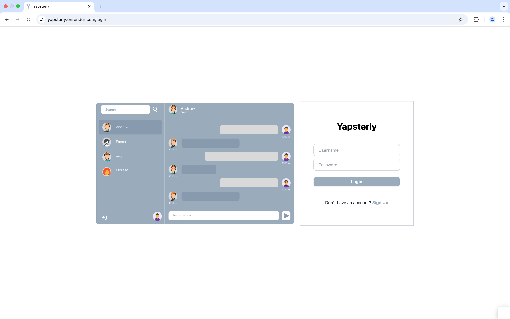

# Yapsterly - Real-Time Web Chat Application

**Yapsterly** is a real-time chat application that allows users to communicate instantly with others. Built with **React**, **Node.js**, **Socket.io**, and **MongoDB**, it features secure authentication, real-time messaging, and a user-friendly interface. The application is designed using **Tailwind CSS** for an optimized and responsive experience.

---

## Key Features

- **Real-Time Messaging**: Instant message exchange between users powered by **Socket.io**.
- **User Authentication**: **JWT** authentication for secure login and signup.
- **Online/Offline Status**: Tracks whether users are online or offline, improving interaction dynamics.
- **Real-Time Notifications**: New messages trigger a notification sound, enhancing the user experience.
- **Responsive Design**: Built with **Tailwind CSS**, ensuring a responsive and visually appealing interface.
- **User-Friendly UI**: Focused on simplicity and ease of use for a seamless chat experience.

---

## Tech Stack

- **Frontend**:
  - **React.js**: JavaScript library for building user interfaces.
  - **Socket.io**: Real-time communication for sending and receiving messages.
  - **Tailwind CSS**: A utility-first CSS framework for styling.
  - **DaisyUI**: A plugin for **Tailwind CSS** that provides pre-built UI components.
  - **Vite**: Fast and efficient build tool for modern web development.

- **Backend**:
  - **Node.js**: JavaScript runtime for the backend.
  - **Express.js**: Web framework to create the backend API.
  - **MongoDB**: NoSQL database to store user and message data.
  - **Mongoose**: Library to interact with MongoDB, simplifying queries and data manipulation.
  - **bcryptjs**: Library for hashing passwords securely.
  - **cookie-parser**: Middleware for handling cookies.
  - **JWT**: JSON Web Token for secure authentication.

---

## Usage

You can try out Yapsterly live at: [Yapsterly](https://yapsterly.onrender.com/)

- **Sign Up**: Users can create an account with their username and password.
- **Login**: After signing up, users can log in using their credentials.
- **Real-Time Chat**: Send and receive messages instantly in the chat window.
- **Online/Offline Status**: See whether the user you’re chatting with is online or offline.
- **Notifications**: New messages trigger a notification sound for better user engagement.

---

## Future Improvements

- **Group Chats**: Support for multiple users in a chat.
- **Dark Mode**: Add a dark mode toggle for improved user experience.
- **File Sharing**: Allow users to send images, files, and other media types.

---

## Acknowledgements

This project is a part of my learning journey as I work towards becoming a full-stack developer. The main goal of this project was to build a web-based chat application to practice and enhance my skills in both front-end and back-end development.

I have found great guidance and support from the **As a Programmer** YouTube channel. I followed along with their tutorials, which provided invaluable insight and hands-on experience as I built and customized the application.

This project is a product of my learning process, and I appreciate all the resources and guidance that contributed to its development.
